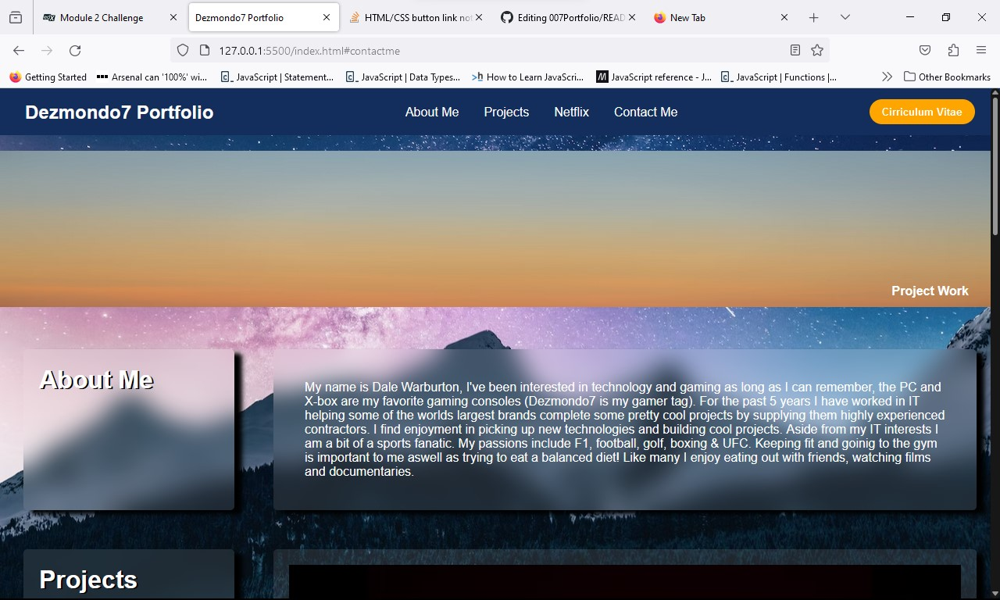
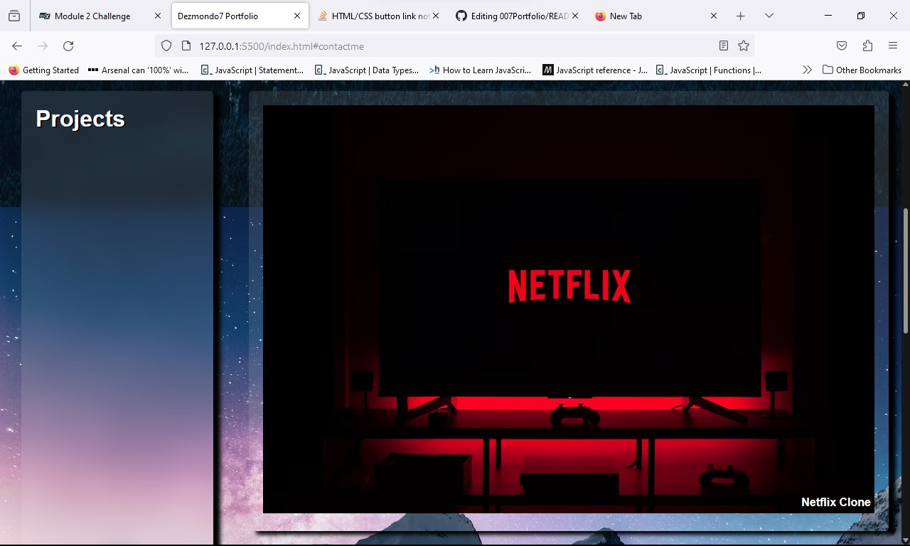
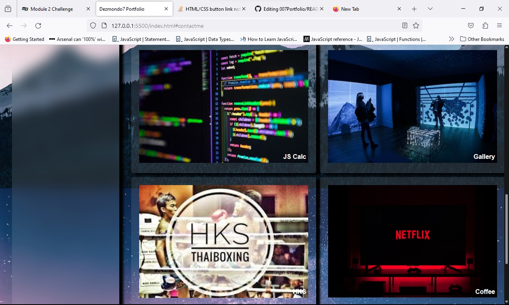
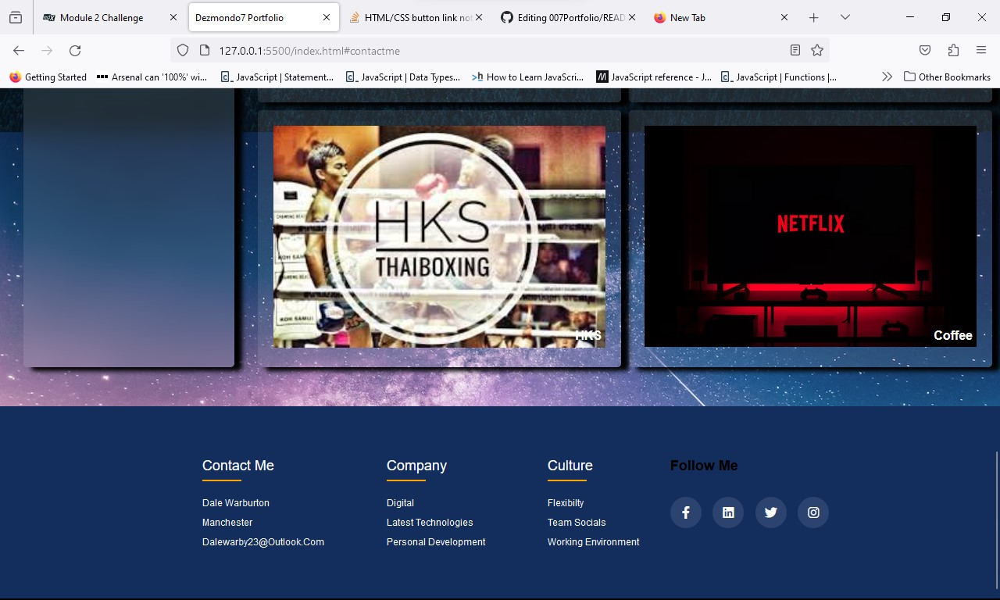

# 007Portfolio

## Responsive website
### The project goal was to build a responsive web portfolio. The portfolio was to be built using HTML and advanced CSS following a blue print design as a guide. The webiste I created was a bespoke version of the blue print using enhanced features including some javascript and animated functions. In the next step I will document how the site was built in stages. 

## Web build
## Navigation Bar
### The development started off with the creation of a repsonsove navbar that captured all of the sites critial information, title, portfolio name, links both internal and external and also a dropdown menu for use across tablet and mobile. Styling went hand in hand with the design as I implemented the use of font awsome. 

## Body
### The body was styled using an image from Unsplash to give it more of a 'spacey' effect. 

## Grid Element
### The grid element presented a challenge given I wanted to replicate the exact layout of the blue print but with a more creative look. I started off by building a small replica of the design and built it out in stages encorporating images and text in the correct positions onto the page. The grid layout used a lot of divs within divs. 

## Grid Images
### The grid images were designed using boarders to hold the images, the images use text anchor links to go to the external page's as in my opnion it worked better. The left hand side of the page and top part of the about me section used transparent background effects to enhance the text. This also helped keep the page's theme going. The text size was scaled down for the tablet and completely removed from the mobile to keep the pages clean. Box-shadow effects were used to make some of the main elements to jump off the page.

## Footer
### The footer took longer than I though it would. I wanted it to look current and also have links to social media aswell as holding my contact details and job preferences. I implemeted icons from font awesome and also added some animations to the other elements within the footer. Once finished I made sure that the footer looked okay within the tablet and mobile dimensions. Given this was the last thing I completed within the time frame I think with more time I could have perfected the footer even more. 

## Research Material
### The following sites were used throughout the build. Stack Overflow. Font Awesome, Mozilla MDM & Class Material.

## Final Version

### Below are several screenshots of the final version of the web portfolio home page, you can find the website live on Github here https://dezmondo7.github.io/007Portfolio/

